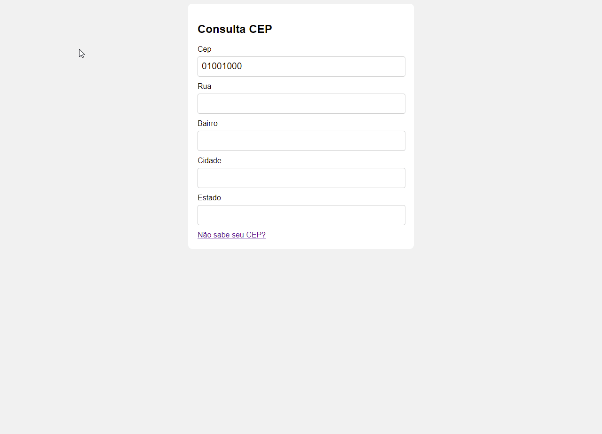

# Consulta CEP JS

<h1 align="center">
    
</h1>

## 🚀 Tecnologias

Esse projeto foi desenvolvido com as seguintes tecnologias:

- HTML
- CSS
- JavaScript

### 📑 Utilitários
- API do [ViaCep](https://viacep.com.br/)
- Editor: **[Visual Studio Code](https://code.visualstudio.com/)**
